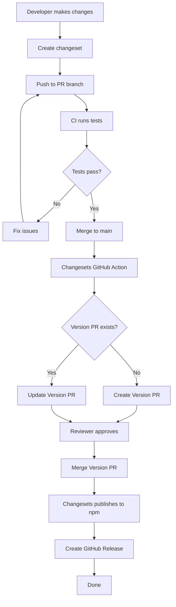
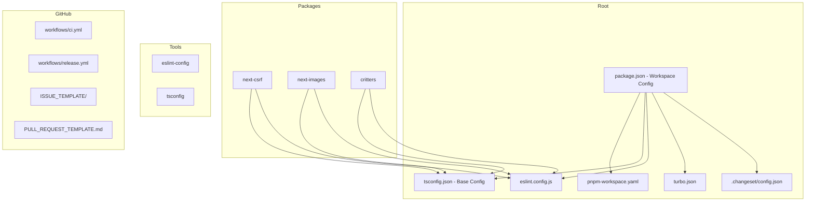
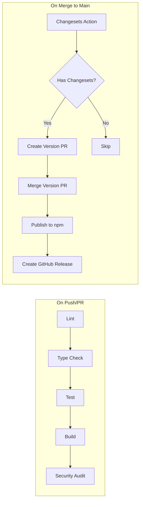
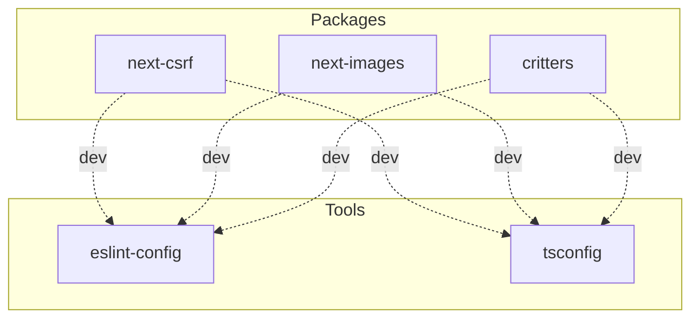

# OpenSource Framework - Repository Architecture

## Overview

This document defines the complete architecture for the OpenSource Framework repository, a monorepo designed to host maintained forks of abandoned npm packages under the `@opensourceframework/*` scope.

## Design Principles

1. **Sustainability**: Easy to maintain and contribute to
2. **Transparency**: Clear provenance and changelogs for all forked packages
3. **Quality**: Enforced code standards, testing, and security practices
4. **Discoverability**: Clear documentation and npm visibility
5. **Automation**: CI/CD for all quality gates and publishing

---

## Complete Directory Structure

```
opensourceframework/
```

---

## Root Repository Structure

```
opensourceframework/
```

---

## Package Structure Template

Each package under `packages/` follows this structure:

```
packages/
```

---

## File Specifications

### Root Files

#### README.md

**Purpose**: Main project documentation and entry point

**Content Structure**:
- Project mission and goals
- Available packages table with status badges
- Quick start guide
- Contributing overview
- Sponsor/maintenance information

---

#### CONTRIBUTING.md

**Purpose**: Guide for contributors

**Content Structure**:
- Code of Conduct reference
- Development environment setup
- Making changes (branch, commit, PR workflow)
- Coding standards
- Testing requirements
- Documentation guidelines
- Package-specific contribution notes

---

#### CODE_OF_CONDUCT.md

**Purpose**: Community standards and enforcement

**Recommendation**: Use Contributor Covenant 2.1

---

#### LICENSE

**Purpose**: Legal usage terms

**Recommendation**: MIT License (permissive, widely compatible)

**Special Consideration**: Each forked package may retain its original license if different from MIT. Document in package README.

---

#### .gitignore

**Purpose**: Exclude non-source files from git

**Content**:
```
# Dependencies
node_modules/
.pnpm-store/

# Build outputs
dist/
*.tsbuildinfo
.turbo/

# IDE
.idea/
.vscode/
*.swp
*.swo

# OS
.DS_Store
Thumbs.db

# Environment
.env
.env.local
.env.*.local

# Logs
logs/
*.log
npm-debug.log*
yarn-debug.log*
yarn-error.log*

# Testing
coverage/
.nyc_output/

# Changesets
.changeset/pre.json

# Misc
*.tgz
.eslintcache
```

---

#### package.json (Root Workspace)

**Purpose**: Workspace configuration and dev dependencies

**Content**:
```json
{
  "name": "opensourceframework",
  "version": "0.0.0",
  "private": true,
  "description": "Maintained forks of abandoned npm packages",
  "keywords": [
    "npm",
    "forks",
    "maintenance",
    "open-source"
  ],
  "author": "OpenSource Framework Contributors",
  "license": "MIT",
  "type": "module",
  "engines": {
    "node": ">=20.0.0",
    "pnpm": ">=9.0.0"
  },
  "packageManager": "pnpm@9.15.0",
  "scripts": {
    "build": "turbo run build",
    "dev": "turbo run dev",
    "lint": "turbo run lint",
    "test": "turbo run test",
    "test:coverage": "turbo run test:coverage",
    "format": "prettier --write .",
    "format:check": "prettier --check .",
    "typecheck": "turbo run typecheck",
    "clean": "turbo run clean && rm -rf node_modules",
    "changeset": "changeset",
    "version-packages": "changeset version",
    "release": "turbo run build && changeset publish",
    "release:canary": "turbo run build && changeset publish --tag canary"
  },
  "devDependencies": {
    "@changesets/cli": "^2.27.0",
    "@commitlint/cli": "^19.0.0",
    "@commitlint/config-conventional": "^19.0.0",
    "@types/node": "^22.0.0",
    "eslint": "^9.0.0",
    "husky": "^9.0.0",
    "prettier": "^3.0.0",
    "tsup": "^8.0.0",
    "turbo": "^2.0.0",
    "typescript": "^5.0.0",
    "vitest": "^2.0.0"
  }
}
```

---

#### pnpm-workspace.yaml

**Purpose**: Define pnpm workspace packages

**Content**:
```yaml
packages:
  - 'packages/*'
  - 'tools/*'
```

---

#### tsconfig.json (Base)

**Purpose**: Shared TypeScript configuration

**Content**:
```json
{
  "$schema": "https://json.schemastore.org/tsconfig",
  "compilerOptions": {
    "target": "ES2022",
    "module": "ESNext",
    "moduleResolution": "bundler",
    "lib": ["ES2022"],
    "strict": true,
    "esModuleInterop": true,
    "skipLibCheck": true,
    "forceConsistentCasingInFileNames": true,
    "resolveJsonModule": true,
    "isolatedModules": true,
    "noUncheckedIndexedAccess": true,
    "noEmit": true,
    "declaration": true,
    "declarationMap": true,
    "sourceMap": true
  },
  "exclude": ["node_modules", "dist"]
}
```

---

#### eslint.config.js (Flat Config)

**Purpose**: Linting rules for code quality

**Content**:
```javascript
import js from '@eslint/js';
import tseslint from 'typescript-eslint';
import prettier from 'eslint-config-prettier';

export default tseslint.config(
  js.configs.recommended,
  ...tseslint.configs.recommended,
  prettier,
  {
    ignores: [
      'node_modules/',
      'dist/',
      'coverage/',
      '*.js',
      '*.mjs',
      '!eslint.config.js'
    ]
  },
  {
    rules: {
      '@typescript-eslint/no-unused-vars': [
        'error',
        { argsIgnorePattern: '^_', varsIgnorePattern: '^_' }
      ],
      '@typescript-eslint/explicit-function-return-type': 'off',
      '@typescript-eslint/explicit-module-boundary-types': 'off',
      '@typescript-eslint/no-non-null-assertion': 'warn'
    }
  }
);
```

---

#### .prettierrc

**Purpose**: Code formatting configuration

**Content**:
```json
{
  "semi": true,
  "singleQuote": true,
  "trailingComma": "es5",
  "tabWidth": 2,
  "useTabs": false,
  "printWidth": 100,
  "bracketSpacing": true,
  "arrowParens": "always",
  "endOfLine": "lf"
}
```

---

#### .prettierignore

**Purpose**: Exclude files from formatting

**Content**:
```
node_modules/
dist/
coverage/
*.md
!.github/
pnpm-lock.yaml
```

---

#### turbo.json

**Purpose**: Turborepo pipeline configuration

**Content**:
```json
{
  "$schema": "https://turbo.build/schema.json",
  "globalDependencies": ["**/.env.*local"],
  "globalEnv": ["NODE_ENV"],
  "tasks": {
    "build": {
      "dependsOn": ["^build"],
      "outputs": ["dist/**", ".next/**", "!.next/cache/**"]
    },
    "dev": {
      "cache": false,
      "persistent": true
    },
    "lint": {
      "dependsOn": ["^build"]
    },
    "typecheck": {
      "dependsOn": ["^build"]
    },
    "test": {
      "dependsOn": ["^build"],
      "outputs": ["coverage/**"]
    },
    "test:coverage": {
      "dependsOn": ["^build"],
      "outputs": ["coverage/**"]
    },
    "clean": {
      "cache": false
    }
  }
}
```

---

#### .changeset/config.json

**Purpose**: Changesets configuration for versioning

**Content**:
```json
{
  "$schema": "https://unpkg.com/@changesets/config@3.0.0/schema.json",
  "changelog": "@changesets/cli/changelog",
  "commit": false,
  "fixed": [],
  "linked": [],
  "access": "public",
  "baseBranch": "main",
  "updateInternalDependencies": "patch",
  "ignore": []
}
```

---

#### .commitlintrc.json

**Purpose**: Enforce conventional commits

**Content**:
```json
{
  "extends": ["@commitlint/config-conventional"],
  "rules": {
    "type-enum": [
      2,
      "always",
      [
        "feat",
        "fix",
        "docs",
        "style",
        "refactor",
        "perf",
        "test",
        "build",
        "ci",
        "chore",
        "revert",
        "deps"
      ]
    ],
    "scope-enum": [
      2,
      "always",
      [
        "next-csrf",
        "next-images",
        "critters",
        "repo",
        "deps",
        "release"
      ]
    ]
  }
}
```

---

### .github/ Directory

#### ISSUE_TEMPLATE/bug_report.yml

**Purpose**: Structured bug report template

**Content**:
```yaml
name: Bug Report
description: Report a bug in one of our packages
labels: ['needs-triage']
body:
  - type: markdown
    attributes:
      value: |
        Thanks for taking the time to report this bug! Please fill out the sections below.
        
  - type: dropdown
    id: package
    attributes:
      label: Affected Package
      description: Which package is affected?
      options:
        - '@opensourceframework/next-csrf'
        - '@opensourceframework/next-images'
        - '@opensourceframework/critters'
        - Other
    validations:
      required: true

  - type: textarea
    id: description
    attributes:
      label: Bug Description
      description: A clear description of what the bug is
    validations:
      required: true

  - type: textarea
    id: reproduction
    attributes:
      label: Reproduction Steps
      description: Steps to reproduce the behavior
      placeholder: |
        1. Install package '...'
        2. Configure with '...'
        3. Run '...'
        4. See error
    validations:
      required: true

  - type: textarea
    id: expected
    attributes:
      label: Expected Behavior
      description: What did you expect to happen?
    validations:
      required: true

  - type: textarea
    id: actual
    attributes:
      label: Actual Behavior
      description: What actually happened?
    validations:
      required: true

  - type: input
    id: version
    attributes:
      label: Package Version
      placeholder: e.g., 1.0.0
    validations:
      required: true

  - type: input
    id: node-version
    attributes:
      label: Node.js Version
      placeholder: e.g., 20.10.0
    validations:
      required: true

  - type: input
    id: os
    attributes:
      label: Operating System
      placeholder: e.g., macOS 14, Windows 11, Ubuntu 22.04
    validations:
      required: true

  - type: textarea
    id: additional
    attributes:
      label: Additional Context
      description: Add any other context, logs, or screenshots about the problem here
```

---

#### ISSUE_TEMPLATE/feature_request.yml

**Purpose**: Structured feature request template

**Content**:
```yaml
name: Feature Request
description: Request a new feature for one of our packages
labels: ['enhancement', 'needs-triage']
body:
  - type: dropdown
    id: package
    attributes:
      label: Affected Package
      description: Which package should this feature be added to?
      options:
        - '@opensourceframework/next-csrf'
        - '@opensourceframework/next-images'
        - '@opensourceframework/critters'
        - New Package Suggestion
    validations:
      required: true

  - type: textarea
    id: problem
    attributes:
      label: Problem Statement
      description: Is your feature request related to a problem? Please describe.
      placeholder: I'm always frustrated when...
    validations:
      required: true

  - type: textarea
    id: solution
    attributes:
      label: Proposed Solution
      description: Describe the solution you'd like to see
    validations:
      required: true

  - type: textarea
    id: alternatives
    attributes:
      label: Alternatives Considered
      description: Describe any alternative solutions or features you've considered

  - type: textarea
    id: additional
    attributes:
      label: Additional Context
      description: Add any other context or screenshots about the feature request here
```

---

#### ISSUE_TEMPLATE/security_vulnerability.yml

**Purpose**: Security vulnerability reporting (redirects to SECURITY.md)

**Content**:
```yaml
name: Security Vulnerability
description: Report a security vulnerability
labels: ['security']
body:
  - type: markdown
    attributes:
      value: |
        **Please do not report security vulnerabilities through public GitHub issues.**
        
        Instead, please report them through GitHub Security Advisories.
        
        Go to: Security > Report a vulnerability
        
        Or visit: https://github.com/opensourceframework/opensourceframework/security/advisories/new
```

---

#### ISSUE_TEMPLATE/config.yml

**Purpose**: Issue template configuration

**Content**:
```yaml
blank_issues_enabled: false
contact_links:
  - name: Documentation
    url: https://github.com/opensourceframework/opensourceframework#readme
    about: Check the documentation before opening an issue
  - name: Discussions
    url: https://github.com/opensourceframework/opensourceframework/discussions
    about: Ask questions and discuss with the community
  - name: Security Policy
    url: https://github.com/opensourceframework/opensourceframework/security/policy
    about: Report security vulnerabilities privately
```

---

#### PULL_REQUEST_TEMPLATE.md

**Purpose**: Standardize PR descriptions

**Content**:
```markdown
## Description

<!-- Provide a clear description of your changes -->

## Related Issue

<!-- Link to the issue this PR addresses -->
Fixes #

## Type of Change

- [ ] Bug fix (non-breaking change that fixes an issue)
- [ ] New feature (non-breaking change that adds functionality)
- [ ] Breaking change (fix or feature that would cause existing functionality to not work as expected)
- [ ] Documentation update
- [ ] Dependency update
- [ ] Refactoring (no functional changes)

## Affected Package(s)

<!-- Check all affected packages -->
- [ ] @opensourceframework/next-csrf
- [ ] @opensourceframework/next-images
- [ ] @opensourceframework/critters
- [ ] Repository/tooling

## Checklist

- [ ] I have read the [Contributing Guidelines](../CONTRIBUTING.md)
- [ ] My code follows the style guidelines of this project
- [ ] I have performed a self-review of my code
- [ ] I have commented my code, particularly in hard-to-understand areas
- [ ] I have made corresponding changes to the documentation
- [ ] My changes generate no new warnings
- [ ] I have added tests that prove my fix is effective or that my feature works
- [ ] New and existing unit tests pass locally with my changes
- [ ] I have added a changeset for this change (run `pnpm changeset`)

## Screenshots (if applicable)

<!-- Add screenshots to help explain your changes -->

## Additional Context

<!-- Add any other context about the PR here -->
```

---

#### SECURITY.md

**Purpose**: Security policy and vulnerability reporting

**Content**:
```markdown
# Security Policy

## Supported Versions

| Package | Version | Supported |
| ------- | ------- | --------- |
| @opensourceframework/next-csrf | >= 1.0.0 | :white_check_mark: |
| @opensourceframework/next-images | >= 1.0.0 | :white_check_mark: |
| @opensourceframework/critters | >= 1.0.0 | :white_check_mark: |

## Security-First Approach

Given that we maintain security-critical packages like `next-csrf`, we take security seriously:

1. **Regular dependency audits** - Automated scanning for vulnerable dependencies
2. **Code review** - All changes require review before merge
3. **Automated testing** - Security-related tests in CI pipeline
4. **Responsible disclosure** - Private reporting before public disclosure

## Reporting a Vulnerability

**Please do not report security vulnerabilities through public GitHub issues.**

Instead, please report them through GitHub Security Advisories:

1. Go to the [Security Advisories page](https://github.com/opensourceframework/opensourceframework/security/advisories/new)
2. Click "Report a vulnerability"
3. Fill out the form with details about the vulnerability

### What to Include

- Description of the vulnerability
- Steps to reproduce
- Affected package and version(s)
- Potential impact
- Suggested fix (if any)

### Response Timeline

- **Initial Response**: Within 48 hours
- **Status Update**: Within 7 days
- **Fix Timeline**: Depends on severity
  - Critical: Within 7 days
  - High: Within 14 days
  - Medium: Within 30 days
  - Low: Next scheduled release

## Security Best Practices

When using our packages:

1. Always use the latest supported version
2. Review security advisories before upgrading
3. Subscribe to GitHub Security Alerts
4. Report any suspicious behavior

## Acknowledgments

We appreciate responsible disclosure and will acknowledge security researchers who help keep our packages secure.
```

---

#### FUNDING.yml

**Purpose**: Enable sponsorship

**Content**:
```yaml
# These are supported funding model platforms
github: [opensourceframework]
open_collective: opensourceframework
```

---

#### workflows/ci.yml

**Purpose**: Main CI pipeline

**Content**:
```yaml
name: CI

on:
  push:
    branches: [main]
  pull_request:
    branches: [main]

concurrency:
  group: ${{ github.workflow }}-${{ github.ref }}
  cancel-in-progress: true

jobs:
  lint:
    name: Lint
    runs-on: ubuntu-latest
    steps:
      - uses: actions/checkout@v4
      
      - name: Setup Node.js
        uses: actions/setup-node@v4
        with:
          node-version: '20'
      
      - name: Setup pnpm
        uses: pnpm/action-setup@v3
        with:
          version: 9
      
      - name: Install dependencies
        run: pnpm install --frozen-lockfile
      
      - name: Lint
        run: pnpm lint

  typecheck:
    name: Type Check
    runs-on: ubuntu-latest
    steps:
      - uses: actions/checkout@v4
      
      - name: Setup Node.js
        uses: actions/setup-node@v4
        with:
          node-version: '20'
      
      - name: Setup pnpm
        uses: pnpm/action-setup@v3
        with:
          version: 9
      
      - name: Install dependencies
        run: pnpm install --frozen-lockfile
      
      - name: Type Check
        run: pnpm typecheck

  test:
    name: Test
    runs-on: ubuntu-latest
    steps:
      - uses: actions/checkout@v4
      
      - name: Setup Node.js
        uses: actions/setup-node@v4
        with:
          node-version: '20'
      
      - name: Setup pnpm
        uses: pnpm/action-setup@v3
        with:
          version: 9
      
      - name: Install dependencies
        run: pnpm install --frozen-lockfile
      
      - name: Test
        run: pnpm test:coverage
      
      - name: Upload Coverage
        uses: codecov/codecov-action@v4
        with:
          token: ${{ secrets.CODECOV_TOKEN }}
          fail_ci_if_error: false

  build:
    name: Build
    runs-on: ubuntu-latest
    needs: [lint, typecheck, test]
    steps:
      - uses: actions/checkout@v4
      
      - name: Setup Node.js
        uses: actions/setup-node@v4
        with:
          node-version: '20'
      
      - name: Setup pnpm
        uses: pnpm/action-setup@v3
        with:
          version: 9
      
      - name: Install dependencies
        run: pnpm install --frozen-lockfile
      
      - name: Build
        run: pnpm build
      
      - name: Upload Build Artifacts
        uses: actions/upload-artifact@v4
        with:
          name: dist
          path: packages/*/dist
          retention-days: 7

  security:
    name: Security Audit
    runs-on: ubuntu-latest
    steps:
      - uses: actions/checkout@v4
      
      - name: Setup Node.js
        uses: actions/setup-node@v4
        with:
          node-version: '20'
      
      - name: Setup pnpm
        uses: pnpm/action-setup@v3
        with:
          version: 9
      
      - name: Install dependencies
        run: pnpm install --frozen-lockfile
      
      - name: Run Security Audit
        run: pnpm audit --audit-level=moderate
        continue-on-error: true
      
      - name: Run Snyk Security Scan
        uses: snyk/actions/node@master
        continue-on-error: true
        env:
          SNYK_TOKEN: ${{ secrets.SNYK_TOKEN }}
```

---

#### workflows/release.yml

**Purpose**: Automated package publishing

**Content**:
```yaml
name: Release

on:
  push:
    branches: [main]

concurrency: ${{ github.workflow }}-${{ github.ref }}

jobs:
  release:
    name: Release
    runs-on: ubuntu-latest
    steps:
      - uses: actions/checkout@v4
      
      - name: Setup Node.js
        uses: actions/setup-node@v4
        with:
          node-version: '20'
          registry-url: 'https://registry.npmjs.org'
      
      - name: Setup pnpm
        uses: pnpm/action-setup@v3
        with:
          version: 9
      
      - name: Install dependencies
        run: pnpm install --frozen-lockfile
      
      - name: Build
        run: pnpm build
      
      - name: Create Release Pull Request or Publish
        id: changesets
        uses: changesets/action@v1
        with:
          publish: pnpm release
          version: pnpm version-packages
          commit: 'chore(release): version packages'
          title: 'chore(release): version packages'
        env:
          GITHUB_TOKEN: ${{ secrets.GITHUB_TOKEN }}
          NPM_TOKEN: ${{ secrets.NPM_TOKEN }}
      
      - name: Send Notification
        if: steps.changesets.outputs.published == 'true'
        run: |
          echo "Packages were published: ${{ steps.changesets.outputs.publishedPackages }}"
```

---

#### workflows/dependabot.yml

**Purpose**: Automated dependency updates

**Content**:
```yaml
name: Dependabot Auto-Merge

on:
  pull_request:
    types: [opened, synchronize, reopened]

permissions:
  contents: write
  pull-requests: write

jobs:
  dependabot:
    name: Dependabot Auto-Merge
    runs-on: ubuntu-latest
    if: ${{ github.actor == 'dependabot[bot]' }}
    steps:
      - name: Dependabot metadata
        id: metadata
        uses: dependabot/fetch-metadata@v2
        with:
          github-token: '${{ secrets.GITHUB_TOKEN }}'
      
      - name: Enable auto-merge for Dependabot PRs
        if: |
          steps.metadata.outputs.update-type == 'version-update:semver-patch' ||
          steps.metadata.outputs.update-type == 'version-update:semver-minor'
        run: gh pr merge --auto --squash "$PR_URL"
        env:
          PR_URL: ${{ github.event.pull_request.html_url }}
          GITHUB_TOKEN: ${{ secrets.GITHUB_TOKEN }}
      
      - name: Approve patch and minor updates
        if: |
          steps.metadata.outputs.update-type == 'version-update:semver-patch' ||
          steps.metadata.outputs.update-type == 'version-update:semver-minor'
        run: gh pr review --approve "$PR_URL"
        env:
          PR_URL: ${{ github.event.pull_request.html_url }}
          GITHUB_TOKEN: ${{ secrets.GITHUB_TOKEN }}
```

---

#### workflows/stale.yml

**Purpose**: Manage stale issues and PRs

**Content**:
```yaml
name: Stale

on:
  schedule:
    - cron: '30 1 * * *'

jobs:
  stale:
    runs-on: ubuntu-latest
    permissions:
      issues: write
      pull-requests: write
    steps:
      - uses: actions/stale@v9
        with:
          repo-token: ${{ secrets.GITHUB_TOKEN }}
          days-before-stale: 60
          days-before-close: 7
          stale-issue-message: |
            This issue has been automatically marked as stale because it has not had recent activity.
            It will be closed in 7 days if no further activity occurs.
            If you believe this issue is still relevant, please add a comment to keep it open.
          stale-pr-message: |
            This PR has been automatically marked as stale because it has not had recent activity.
            It will be closed in 7 days if no further activity occurs.
            If you are still working on this PR, please add a comment or push a commit to keep it open.
          close-issue-message: |
            This issue has been automatically closed due to inactivity.
            If you believe this is still relevant, please reopen the issue or create a new one with updated information.
          close-pr-message: |
            This PR has been automatically closed due to inactivity.
            If you would like to continue this work, please reopen the PR or create a new one.
          stale-issue-label: 'stale'
          stale-pr-label: 'stale'
          exempt-issue-labels: 'pinned,security,help wanted'
          exempt-pr-labels: 'pinned,security,work in progress'
```

---

### Package Files

#### packages/[package-name]/package.json

**Purpose**: Package configuration and metadata

**Template**:
```json
{
  "name": "@opensourceframework/[package-name]",
  "version": "0.0.0",
  "description": "[Package description]",
  "keywords": [
    "[relevant-keywords]"
  ],
  "author": "OpenSource Framework Contributors",
  "license": "MIT",
  "type": "module",
  "exports": {
    ".": {
      "import": {
        "types": "./dist/index.d.ts",
        "default": "./dist/index.js"
      },
      "require": {
        "types": "./dist/index.d.cts",
        "default": "./dist/index.cjs"
      }
    },
    "./package.json": "./package.json"
  },
  "main": "./dist/index.cjs",
  "module": "./dist/index.js",
  "types": "./dist/index.d.ts",
  "files": [
    "dist",
    "README.md",
    "CHANGELOG.md",
    "LICENSE"
  ],
  "scripts": {
    "build": "tsup",
    "dev": "tsup --watch",
    "lint": "eslint src/",
    "typecheck": "tsc --noEmit",
    "test": "vitest run",
    "test:watch": "vitest",
    "test:coverage": "vitest run --coverage",
    "clean": "rm -rf dist coverage node_modules"
  },
  "dependencies": {
    "[dependencies]": "[version]"
  },
  "devDependencies": {
    "@types/node": "^22.0.0",
    "tsup": "^8.0.0",
    "typescript": "^5.0.0",
    "vitest": "^2.0.0"
  },
  "repository": {
    "type": "git",
    "url": "git+https://github.com/opensourceframework/opensourceframework.git",
    "directory": "packages/[package-name]"
  },
  "bugs": {
    "url": "https://github.com/opensourceframework/opensourceframework/issues?q=is%3Aissue+is%3Aopen+[package-name]"
  },
  "homepage": "https://github.com/opensourceframework/opensourceframework/tree/main/packages/[package-name]#readme",
  "publishConfig": {
    "access": "public"
  }
}
```

---

#### packages/[package-name]/tsconfig.json

**Purpose**: Package-specific TypeScript config

**Content**:
```json
{
  "$schema": "https://json.schemastore.org/tsconfig",
  "extends": "../../tsconfig.json",
  "compilerOptions": {
    "outDir": "./dist",
    "rootDir": "./src"
  },
  "include": ["src/**/*"],
  "exclude": ["node_modules", "dist", "**/*.test.ts"]
}
```

---

#### packages/[package-name]/tsup.config.ts

**Purpose**: Build configuration for tsup

**Content**:
```typescript
import { defineConfig } from 'tsup';

export default defineConfig({
  entry: ['src/index.ts'],
  format: ['cjs', 'esm'],
  dts: true,
  splitting: false,
  sourcemap: true,
  clean: true,
  minify: false,
  treeshake: true,
  external: [],
});
```

---

#### packages/[package-name]/vitest.config.ts

**Purpose**: Test configuration

**Content**:
```typescript
import { defineConfig } from 'vitest/config';

export default defineConfig({
  test: {
    globals: true,
    environment: 'node',
    include: ['src/**/*.test.ts', 'test/**/*.test.ts'],
    coverage: {
      provider: 'v8',
      reporter: ['text', 'json', 'html'],
      exclude: [
        'node_modules/',
        'dist/',
        '**/*.d.ts',
        '**/*.test.ts',
        '**/*.config.ts',
      ],
    },
  },
});
```

---

#### packages/[package-name]/README.md

**Purpose**: Package documentation

**Template**:
```markdown
# @opensourceframework/[package-name]

> [Brief description of the package]

[](https://www.npmjs.com/package/@opensourceframework/[package-name])
[](https://www.npmjs.com/package/@opensourceframework/[package-name])
[](./LICENSE)

## About

This is a maintained fork of the original `[original-package-name]` package, which was [abandoned/archived] on [date].

### Why This Fork?

- [Reason 1: e.g., Security updates]
- [Reason 2: e.g., Bug fixes]
- [Reason 3: e.g., TypeScript improvements]

### Original Package

- **Original Repository**: [link to original repo]
- **Original npm Package**: [link to npm]
- **Fork Reason**: [brief explanation]
- **Fork Date**: [date]

## Installation

```bash
npm install @opensourceframework/[package-name]
# or
yarn add @opensourceframework/[package-name]
# or
pnpm add @opensourceframework/[package-name]
```

## Usage

```typescript
// Usage example
import { something } from '@opensourceframework/[package-name]';

// Code example
```

## API Reference

[Document main API exports]

## Migration Guide

If migrating from the original package:

```diff
- import { something } from '[original-package-name]';
+ import { something } from '@opensourceframework/[package-name]';
```

[Additional migration notes if needed]

## Contributing

See the [root contributing guide](../../CONTRIBUTING.md) for general contribution information.

For this package specifically:
- [Package-specific notes]
- [Testing instructions]
- [Development setup]

## Changelog

See [CHANGELOG.md](./CHANGELOG.md) for details about changes.

## License

[MIT](./LICENSE) - Same license as original package (or note if different)

## Credits

- Original author: [original author name/link]
- Maintainers: [OpenSource Framework contributors]
```

---

#### packages/[package-name]/CHANGELOG.md

**Purpose**: Track changes to the package

**Template**:
```markdown
# @opensourceframework/[package-name]

## 0.0.1

### Patch Changes

- Forked from `[original-package-name]@x.x.x`
- Initial release under `@opensourceframework` scope
- Added TypeScript types
- Updated dependencies to latest versions
- Fixed [specific bugs from original issues]

---

## Historical Changelog

The following is preserved from the original package:

[Original changelog content if available]
```

---

#### packages/[package-name]/src/index.ts

**Purpose**: Package entry point

**Content**: Export all public APIs from the package

---

#### packages/[package-name]/src/[module].ts

**Purpose**: Source code modules

**Content**: Package implementation

---

#### packages/[package-name]/test/index.test.ts

**Purpose**: Test suite

**Content**: Unit and integration tests

---

### Tools Directory

#### tools/eslint-config/package.json

**Purpose**: Shared ESLint configuration package

**Content**:
```json
{
  "name": "@opensourceframework/eslint-config",
  "version": "0.0.0",
  "private": true,
  "main": "index.js",
  "exports": {
    ".": "./index.js"
  },
  "files": ["index.js"]
}
```

---

#### tools/tsconfig/package.json

**Purpose**: Shared TypeScript configuration package

**Content**:
```json
{
  "name": "@opensourceframework/tsconfig",
  "version": "0.0.0",
  "private": true,
  "main": "index.json",
  "exports": {
    ".": "./index.json",
    "./base.json": "./base.json"
  },
  "files": ["*.json"]
}
```

---

## Tooling Recommendations

### Build System: Turborepo + tsup

**Rationale**:
- **Turborepo**: Fast monorepo builds with intelligent caching, remote caching support
- **tsup**: Simple, fast TypeScript bundler built on esbuild, excellent for library publishing

**Alternatives Considered**:
- Nx: More complex, better for applications
- Rollup: More configuration, slower builds
- Vite: Great for apps, overkill for libraries

### Package Manager: pnpm

**Rationale**:
- Efficient disk space usage with content-addressable storage
- Strict dependency resolution prevents phantom dependencies
- Built-in workspace support
- Fast installs

### Testing: Vitest

**Rationale**:
- Fast, Vite-powered test runner
- Native ESM support
- TypeScript support out of the box
- Compatible with Jest API for easy migration
- Built-in coverage with v8

### Versioning: Changesets

**Rationale**:
- Industry standard for monorepo versioning
- Automatic changelog generation
- Multi-package version coordination
- GitHub Actions integration for automated releases

### Code Quality: ESLint + Prettier

**Rationale**:
- Standard tooling, wide ecosystem
- TypeScript-eslint for type-aware linting
- Prettier for consistent formatting
- Husky + lint-staged for pre-commit hooks

---

## Versioning Strategy

### Forked Package Versioning

When forking an abandoned package:

1. **Initial Version**: Start from the original package's last version + patch bump
   - Example: Original was `2.5.0` (last release), fork starts at `2.5.1` or `3.0.0` (if breaking changes)

2. **Version Bump Rules**:
   - **PATCH**: Bug fixes, security updates, dependency updates
   - **MINOR**: New features, backwards-compatible API additions
   - **MAJOR**: Breaking changes, major refactors

3. **Pre-release Versions**: Use for testing before stable release
   - Format: `x.x.x-canary.x` or `x.x.x-beta.x`

### Changeset Categories

```json
{
  "major": "Breaking changes",
  "minor": "New features",
  "patch": "Bug fixes, security updates"
}
```

### Version Coordination

Since packages are independent, use Changesets' default behavior:
- Each package versions independently
- No linked versions (packages don't need to stay in sync)

---

## Publishing Workflow

### Prerequisites

1. **npm Account**: Organization account for `@opensourceframework` scope
2. **Automation Token**: npm automation token for CI/CD
3. **GitHub Secrets**: Configure in repository settings

### GitHub Secrets Required

| Secret | Purpose |
|--------|---------|
| `NPM_TOKEN` | npm automation token for publishing |
| `GITHUB_TOKEN` | Automatically provided by GitHub |
| `SNYK_TOKEN` | Optional, for security scanning |
| `CODECOV_TOKEN` | Optional, for coverage reports |

### Publishing Process



### Manual Publishing (Emergency)

```bash
# Build all packages
pnpm build

# Version packages
pnpm version-packages

# Publish to npm
pnpm release

# For canary releases
pnpm release:canary
```

---

## GitHub Features

### Repository Settings

1. **Branch Protection** (main branch):
   - Require PR reviews (1 approval)
   - Require status checks to pass
   - Require linear history
   - Include administrators

2. **Merge Options**:
   - Enable squash merge only
   - Enable auto-merge for approved PRs

3. **Issue Management**:
   - Enable Issues
   - Enable Discussions
   - Enable Wiki (optional)

### Labels

Recommended labels for issues and PRs:

| Label | Color | Purpose |
|-------|-------|---------|
| `needs-triage` | #FFEA00 | New issues awaiting review |
| `bug` | #D73A4A | Something isn't working |
| `security` | #B60205 | Security-related issue |
| `enhancement` | #A2EEEF | New feature or request |
| `documentation` | #0075CA | Documentation improvements |
| `help wanted` | #008672 | Extra attention needed |
| `good first issue` | #7057FF | Good for newcomers |
| `blocked` | #000000 | Blocked by external factor |
| `wontfix` | #FFFFFF | Won't be fixed |
| `stale` | #E4E669 | No recent activity |
| `package:next-csrf` | #1D76DB | next-csrf specific |
| `package:next-images` | #1D76DB | next-images specific |
| `package:critters` | #1D76DB | critters specific |

### Discussions Categories

1. **Announcements**: Release announcements, important updates
2. **General**: General discussion about packages
3. **Ideas**: Feature requests and suggestions
4. **Q&A**: Questions and answers
5. **Show and Tell**: Examples of usage

---

## Initial Setup Instructions

### 1. Create npm Organization

```bash
# Create npm account if needed
# Create organization: @opensourceframework
# Configure 2FA for organization
```

### 2. Create GitHub Repository

```bash
# Create repository: opensourceframework/opensourceframework
# Enable Discussions, Issues, Wiki
# Configure branch protection for main
```

### 3. Configure GitHub Secrets

Add the following secrets in repository settings:
- `NPM_TOKEN`: Create at npm.com > Access Tokens > Automation Token
- `SNYK_TOKEN`: Optional, for security scanning
- `CODECOV_TOKEN`: Optional, for coverage reports

### 4. Initialize Repository

```bash
# Clone repository
git clone https://github.com/opensourceframework/opensourceframework.git
cd opensourceframework

# Initialize pnpm
pnpm install

# Create initial structure (run in code mode)
# - Create all root files
# - Create .github directory structure
# - Create tools packages
# - Create initial package directories

# Verify setup
pnpm build
pnpm test
pnpm lint
```

### 5. Fork Priority Packages

In order of priority:

1. **next-csrf** (PRIORITY 1 - Security Critical)
   ```bash
   # Create package directory
   mkdir -p packages/next-csrf
   
   # Clone original repository
   git clone https://github.com/[original-repo] temp/next-csrf
   
   # Copy source files, adapt structure
   # Update package.json
   # Add TypeScript types if missing
   # Fix open issues
   # Add tests
   ```

2. **next-images**
   ```bash
   # Similar process
   ```

3. **critters**
   ```bash
   # Similar process
   ```

### 6. First Release

```bash
# Create changesets for each package
pnpm changeset

# Version packages
pnpm version-packages

# Create PR, review, merge
# Changesets will auto-publish
```

---

## Mermaid Diagrams

### Repository Structure Overview



### CI/CD Pipeline



### Dependency Graph



---

## Summary

This architecture provides:

1. **Scalable Monorepo**: Turborepo + pnpm for efficient multi-package management
2. **Quality Gates**: ESLint, TypeScript, Vitest, security audits in CI
3. **Automated Publishing**: Changesets for version management and npm publishing
4. **Community Engagement**: Issue templates, PR templates, discussions, contributing guide
5. **Transparency**: Clear provenance, changelogs, and fork documentation
6. **Security-First**: Security policy, private vulnerability reporting, automated audits

The next step is to switch to Code mode to implement this architecture by creating all the files and directories defined in this document.